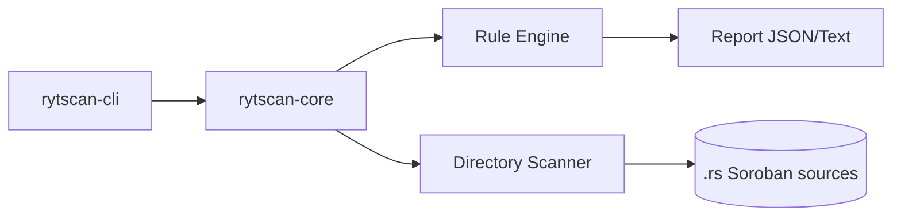
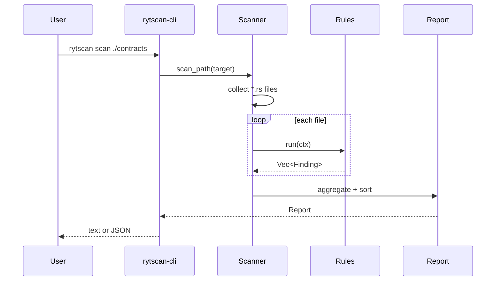
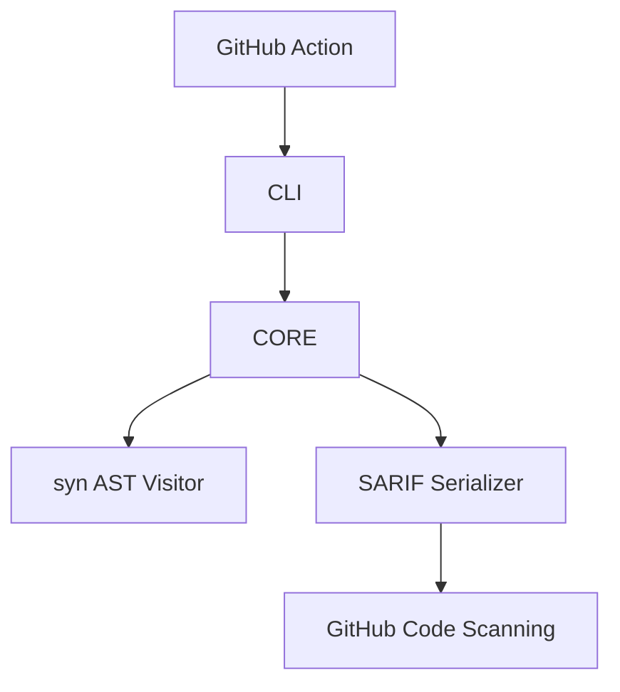

# Architecture: RytScan

**Version:** 1.0  
**Last updated:** 2026-06-24

## 1. System Overview

RytScan is a Rust workspace with a library crate (rule engine) and a CLI binary.



## 2. Crate Layout

| Crate | Role |
|---|---|
| `rytscan-core` | Rule trait, 6 detectors, report model, file walker |
| `rytscan-cli` | Clap CLI, output formatting, exit codes |

## 3. Scan Pipeline



### 3.1 File Discovery

- Recursively walks target directory via `walkdir`
- Includes `*.rs` files; excludes `/tests/` and `*_test.rs` by default
- `--include-tests` overrides exclusion

### 3.2 Rule Context

Each rule receives:

```rust
RuleContext {
    file: &str,      // relative path
    source: &str,    // full file contents
    lines: &[String] // line-indexed for snippets
}
```

Phase 1 uses function-block extraction (brace counting) and line heuristics. Phase 2 replaces this with `syn` AST visitors.

## 4. Rule Catalog

| ID | Engine | Severity | Detection strategy |
|---|---|---|---|
| AUTH-001 | Function analysis | High | State-changing `pub fn` without `require_auth` |
| PANIC-001 | Line scan | Medium | `unwrap`, `expect`, `panic!` |
| TOKEN-001 | Line scan | High | `.transfer(` without result check |
| EVENT-001 | Function analysis | Low | State change without `env.events()` |
| TTL-001 | Function analysis | Medium | `.persistent().set` without `extend_ttl` |
| STORE-001 | Line scan | High | `.temporary().set` with durable keys |

## 5. Report Model

```json
{
  "tool": "RytScan",
  "version": "0.1.0",
  "target": "fixtures/vulnerable-vault/src",
  "summary": {
    "files_scanned": 1,
    "rules_run": 6,
    "findings": 5,
    "by_severity": { "high": 3, "medium": 1, "low": 1 }
  },
  "findings": [ ... ]
}
```

Exit codes:

| Code | Meaning |
|---|---|
| 0 | Scan complete, no findings ≥ `--fail-on` threshold |
| 1 | Findings at or above threshold |
| 2 | Invalid path / runtime error |

## 6. Fixtures

```
fixtures/
├── vulnerable-vault/src/lib.rs   # intentional issues for regression
└── clean-token/src/lib.rs        # passes high-severity checks
```

Used by `cargo test` in `rytscan-core` and documented in README quick start.

## 7. Phase 2 Architecture (Planned)



## 8. Security & Limitations

- **Static only:** Cannot detect runtime-only bugs or economic exploits
- **Heuristic:** Phase 1 may false-positive on complex macros; suppressions come in Phase 2
- **No network:** Scanner never sends source code off-machine
- **Fail closed in CI:** Default `--fail-on high` blocks merges on auth/token issues

## 9. Wave Integration Points

| Phase | Drips contributor workflow |
|---|---|
| 1 ✅ | `rytscan scan .` before opening Wave PR |
| 2 | GitHub Action comment on PR with findings |
| 3 | Testnet deploy checklist includes RytScan + invoke probe |
| 4 | Match scan gaps to open Wave security issues |

Browse: [Drips Stellar Wave Issues](https://www.drips.network/wave/stellar/issues)
